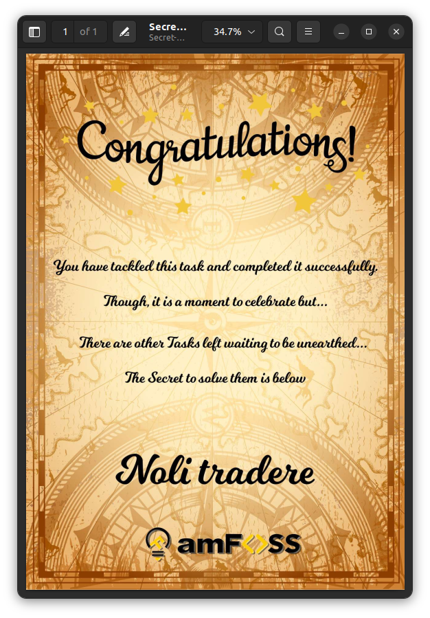

## Solving the Terminal Hunt

1. Create a local copy of the repository on the machine.  
`git clone https://github.com/gauthamk02/TerminalHunt.git` 

2. Switch the working directory using the `cd` command.  
`cd TerminalHunt/`  

3. Create a directory to store the solution shards in.  
`mkdir solution`

4. Store the first shard of the solution in a file using any text editor.
`vim solution/part1.txt`

5. Copy the file with the second shard into the solution directory and rename it.
```
cp 06/1.txt solution/
mv solution/1.txt solution/part2.txt
```

6. View the git log, find the third shard of the solution, copy and rename it.
```
git log
cp 10/1.txt solution/
mv solution/1.txt solution/part3.txt
```

7. Add the new solution directory to the staging environment and commit the changes.
```
git add solution
git commit -m "Uploaded three parts of the solution"
```

8. Switch to the branch with the next part of the solution, find the required file, merge it with the main branch, and relocate the key file.
```
git branch -a
git checkout asia
find . -name athens.txt
git checkout main
git merge asia
cp NewFolder/Greek-Empire/athens.txt solution/
mv solution/athens.txt solution/part4.txt
```

9. Concatenate all the solution shards into a single file and delete the former.
```
cd solution/
cat part1.txt part2.txt part3.txt part4.txt > password1.txt
rm -rf part1.txt part2.txt part3.txt part4.txt
```

10. Unlock the PDF file using the concetenated text in `password.txt`.


11. Create a SOLUTION.md file with all the steps in the amFOSS tasks directory.
`vim ~/amfoss-tasks/task-02/SOLUTION.md`

12. Insert a screenshot of the unlocked PDF file in the same folder.

13. Add the task directory to the staging environment (assuming git had already been initialised in the parent folder). Commit the changes and push it to Github to make it public.
```
git add ~/amfoss-tasks/task02
git commit -m "Uploaded the solution and screenshot"
git push
```
