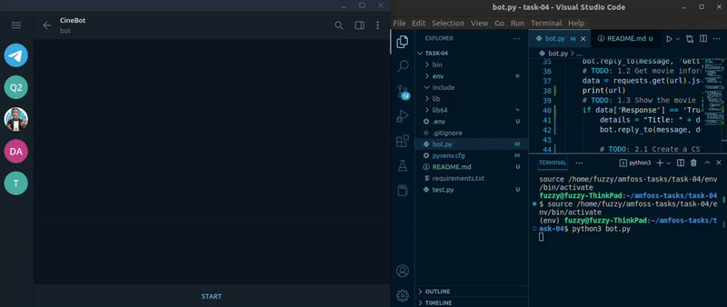

# Cinebot

A telegram bot to retrieve the details of a movie, display them in the chat window, and compile them into a downloadable CSV file. It sends an HTML request to the [OMDb API](https://www.omdbapi.com) which returns the data in a JSON format.

The program was incomplete at the time of submission as I had failed to use environment variables. I'm embarrassed to admit that I uploaded my bot's secret key in full display along with the source code. It has since been removed, and the program has been updated with the complete code. The `lib64` file which was accidentally pushed has also been added to the `.gitignore` file.

Edit: The code was changed once again to change the way environment variables were stored and accessed. The previous version unnecessarily made use of the dotenv module and a .env file.

## Bot Preview
