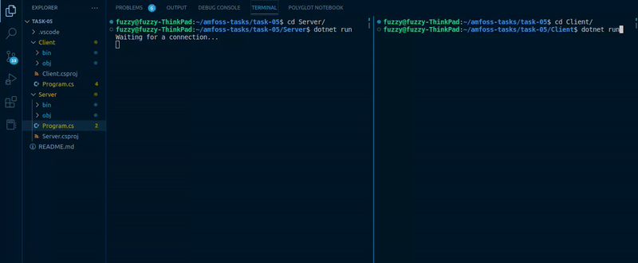

# Find the Bug

A basic CLI application implemented in .NET Framework, which retrieves data from the client, and displays and stores it on the server side in a JSON file.

Despite having completed this challenge, this is a task that I am by no means comfortable with. While I can comprehend the basic working of a server-client system, I do not understand the implication of each line of code on a standalone basis. The debugging was done largely by comparison with tutorials from the web, and the error messages by the IDE helped identify the missing namespaces. The only error that was personally pointed out may have been the mismatched IP addresses of the endpoints between the server and the client.

This was my least favourite task to work on as it was frustrating not being able to understand exactly what I was working with. I might revisit this task again later and read more about socket programming in C# to get a clearer idea of what function each line of the code has.

## Preview
