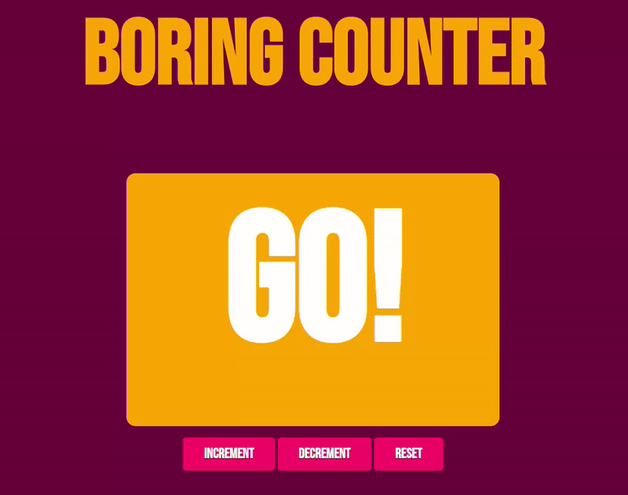

# Web Assembly
A counter deployed on the web using a Golang backend for the scripts, as opposed to the typical javascript. The Go file is compiled to web assembly format, which is supported by modern browsers.

I can understand why this task has the reputation of being the hardest one on the list. Thankfully I had some guidance on where to look for the answers to the questions that I had, which enabled me to understand this and complete it in a few hours ~~before the deadline~~. The most challenging part of this task was to grasp how to interact with the DOM correctly. This was personally the most fun task to learn for me, although I'm sure that wouldn't have been the case had I not had some outside help. Attempting Task #8 first was a massive help as well, as I had not worked with HTML prior to this. It made understanding how HTML, CSS, javascript, and web assembly all tied together much easier than if I had attempted it with no introduction.

## Preview
