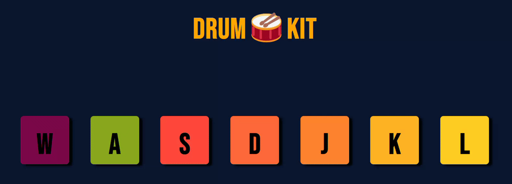

# Drum Kit

An HTML page that plays various sounds when buttons are clicked.

While this task is pretty simple and straightforward, I had some trouble figuring out how to access the elements from the HTML document using javascript (before I was told that I didn't have to do that at all). Once that part was out of the way, this was undoubtedly the simplest task yet attempted.

This task helped me get an idea of how HTML, CSS and JS differ from each other in their functions, and how the work together to form a website.

## Preview (without sound)

